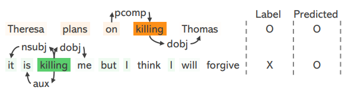
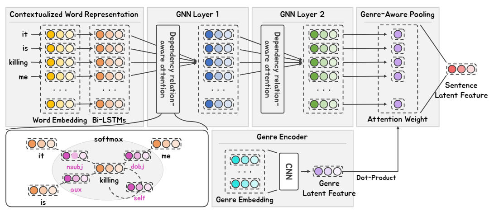

# SDGNN

This repository contains the code for our paper [“Killing Me” Is Not a Spoiler: Spoiler Detection Model using Graph Neural Networks with Dependency Relation-Aware Attention Mechanism](https://arxiv.org/pdf/2101.05972.pdf).

## Quick links

- [Overview](#overview)
- [Getting Started](#getting-started)
- [Requirements](#requirements)
- [Evaluation](#evaluation)
- [Training](#training)
- [Citation](#citation)
- [Contacts](#contacts)

## Overview

We propose a simple spoiler detection model utilizing GNN for sentences structured as dependency tree. The following figure is an illustration of our models.



The following figure is an illustration of our models.



## Getting started

1. Configure `global_configs.py`

   `global_configs.py` defines global constants for runnning experiments. Dimensions of data modality (text, acoustic, visual), cpu/gpu settings, and MAG's injection position. Default configuration is set to **MOSI**. For running experiments on **MOSEI** or on custom dataset, make sure that **ACOUSTIC_DIM** and **VISUAL_DIM** are set approperiately.

   ```python
   os.environ["CUDA_VISIBLE_DEVICES"] = "0"
   os.environ["WANDB_PROGRAM"] = "multimodal_driver.py"

   DEVICE = torch.device("cuda:0")

    # MOSI SETTING
    ACOUSTIC_DIM = 74
    VISUAL_DIM = 47
    TEXT_DIM = 768

    # MOSEI SETTING
    # ACOUSTIC_DIM = 74
    # VISUAL_DIM = 35
    # TEXT_DIM = 768

    # CUSTOM DATASET
    # ACOUSTIC_DIM = ??
    # VISUAL_DIM = ??
    # TEXT_DIM = ??

   XLNET_INJECTION_INDEX = 1
   ```

2. Download datasets
   Inside `./datasets` folder, run `./download_datasets.sh` to download MOSI and MOSEI datasets

3. Training MAG-BERT / MAG-XLNet on MOSI

   First, install python dependancies using `pip install -r requirements.txt`

   **Training scripts:**

   - MAG-BERT `python multimodal_driver.py --model bert-base-uncased`
   - MAG-XLNet `python multimodal_driver.py --model xlnet-base-cased`

   By default, `multimodal_driver.py` will attempt to create a [Weights and Biases (W&B)](https://www.wandb.com/) project to log your runs and results. If you wish to disable W&B logging, set environment variable to `WANDB_MODE=dryrun`.

4. Model usage

   We would like to thank [huggingface](https://huggingface.co/) for providing and open-sourcing BERT / XLNet code for developing our models. Note that bert.py / xlnet.py are based on huggingface's implmentation.

   **Transformer**

   ```python
   from modeling import MAG

   hidden_size, beta_shift, dropout_prob = 768, 1e-3, 0.5
   multimodal_gate = MAG(hidden_size, beta_shift, dropout_prob)

   fused_embedding = multimodal_gate(text_embedding, visual_embedding, acoustic_embedding)
   ```

   **BART**

   ```python
   from bert import MAG_BertForSequenceClassification

   class MultimodalConfig(object):
       def __init__(self, beta_shift, dropout_prob):
           self.beta_shift = beta_shift
           self.dropout_prob = dropout_prob

   multimodal_config = MultimodalConfig(beta_shift=1e-3, dropout_prob=0.5)
   model = MAG_BertForSequenceClassification.from_pretrained(
           'bert-base-uncased', multimodal_config=multimodal_config, num_labels=1,
       )

   outputs = model(input_ids, visual, acoustic, attention_mask, position_ids)
   logits = outputs[0]
   ```

   **T5**

   ```python
   from bert import MAG_BertForSequenceClassification

   class MultimodalConfig(object):
       def __init__(self, beta_shift, dropout_prob):
           self.beta_shift = beta_shift
           self.dropout_prob = dropout_prob
   ```

## Dataset Format

All datasets are saved under `./data/` folder and is encoded as .txt file.
Format of dataset is as follows:

```python
{
   "train": [
       (words, visual, acoustic), label_id, segment,
       ...
   ],
   "dev": [ ... ],
   "test": [ ... ]
}
```

- words (List[str]): List of words
- visual (np.array): Numpy array of shape (sequence_len, VISUAL_DIM)
- acoustic (np.array): Numpy array of shape (seqeunce_len, ACOUSTIC_DIM)
- label_id (float): Label for data point
- segment (Any): Unique identifier for each data point

Dataset is encoded as python dictionary and saved as .pkl file

```python
import pickle as pkl

# NOTE: Use 'wb' mode
with open('data.pkl', 'wb') as f:
   pkl.dump(data, f)
```

## Experiments

|AUROC|내용|설명|
|------|---|---|

|제목|내용|설명|
|:---|---:|:---:|
|내용|우측정렬|중앙정렬|
|왼쪽정렬|*기울이기*|**강조**|
|왼쪽정렬|<span style="color:red">강조3</span>|중앙정렬|

## Citation

Please cite our paper if you use SDGNN in your work:

```
@article{chang2021killing,
  title={" Killing Me" Is Not a Spoiler: Spoiler Detection Model using Graph Neural Networks with Dependency Relation-Aware Attention Mechanism},
  author={Chang, Buru and Lee, Inggeol and Kim, Hyunjae and Kang, Jaewoo},
  journal={arXiv preprint arXiv:2101.05972},
  year={2021}
}
```

## Contacts

- Buru Chang: buru@hpcnt.com
- Inggeol Lee: ingulbull@korea.ac.kr
- Hyunjae Kim: hyunjae-kim@korea.ac.kr
